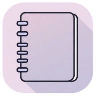
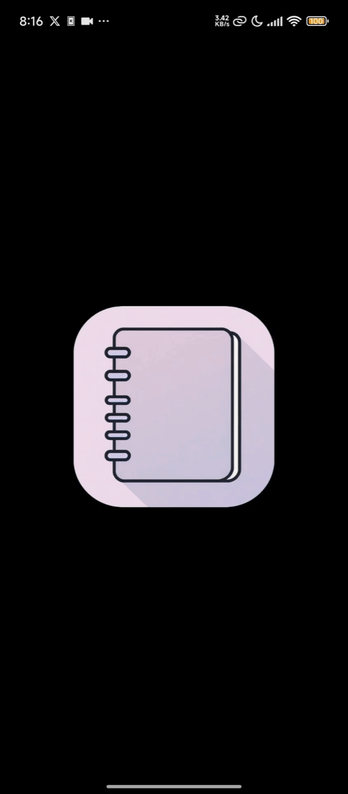

  
  <h1>✨ Simple Notes ✨</h1>

  
  
  
  
  > 🌟 A sleek, iOS-inspired notes taking PWA with dark mode and smooth interactions

---

### 🚀 Key Features

| Feature Highlights |
|-------------------|
| 📝 **Rich Text Editing** - Bold, italic, underline, lists, and alignment |
| 🎨 **Text Sizing** - Multiple text sizes for better organization |
| 🌙 **Dark Mode** - Easy on the eyes with automatic theme persistence |
| 🔍 **Quick Search** - Search through notes' titles and content |
| 💾 **Auto-saving** - Changes are saved automatically |
| ↩️ **Undo/Redo** - Full undo/redo support for text editing |
| 📱 **Touch Gestures** - Swipe to go back or delete notes |
| 📲 **PWA Support** - Install and use offline on any device |

### 📸 App in Action

### 💻 Tech Stack

### 📄 License

Released under the [Unlicense](LICENSE). This is free and unencumbered software released into the public domain.

  Built with ❤️ by rulercosta

